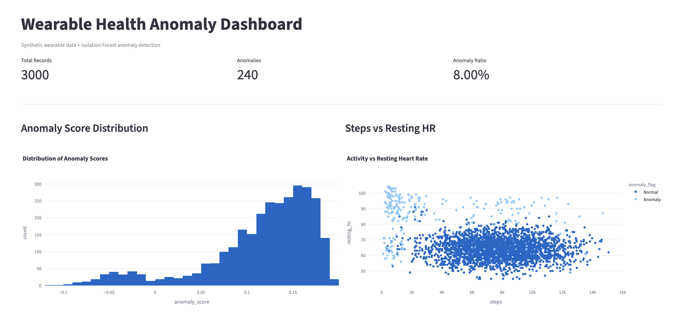
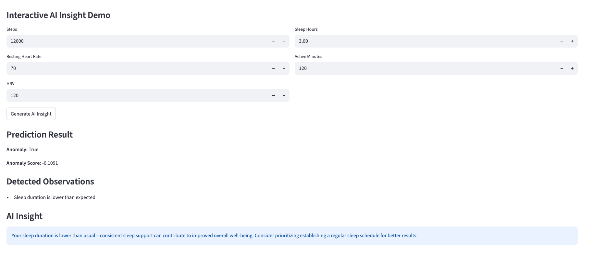
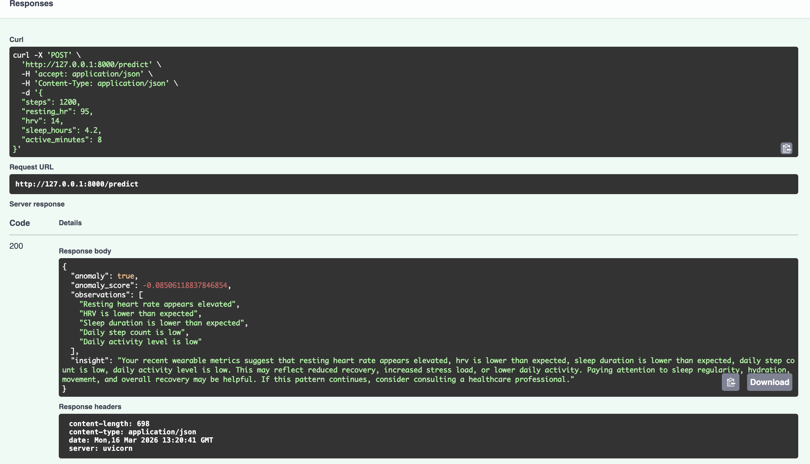

# Wearable Health Anomaly Detection

An end-to-end AI system for detecting abnormal patterns in wearable health data.

This project simulates wearable device data (steps, resting heart rate, HRV, sleep hours, activity minutes) and applies an Isolation Forest model to detect unusual physiological patterns.

The system includes:

• Synthetic health data generation  
• Isolation Forest anomaly detection model  
• FastAPI prediction API  
• Streamlit monitoring dashboard  
• Git-based reproducible ML pipeline  

# Project Architecture

Synthetic Data Generator  
↓  
Isolation Forest Training  
↓  
Model Serialization (.joblib)  
↓  
FastAPI Prediction API  
↓  
Streamlit Dashboard  

# Features

• Detect abnormal physiological patterns  
• Analyze wearable device metrics  
• Visualize anomalies in an interactive dashboard  
• Deployable API for real-time predictions  

# AI Insight Engine (LLM Integration)

This project goes beyond traditional anomaly detection by integrating a local Large Language Model (LLM) to generate natural language health insights.

## How it works

1. Wearable data is processed through an Isolation Forest model
2. Anomalies and key observations are identified
3. Observations are passed to a local LLM via Ollama
4. The LLM generates a short, human-readable, supportive health insight

## Example Output

**Observations**
- Resting heart rate appears elevated
- HRV is lower than expected
- Sleep duration is lower than expected
- Daily step count is low
- Daily activity level is low

**AI Insight**
> Your body is currently experiencing reduced recovery and increased physiological strain. Lower sleep duration, reduced HRV, and low daily activity may suggest that your system needs better rest and balance. Paying attention to sleep consistency and light movement may help support recovery.

# Technologies Used

Python  
Scikit-Learn  
FastAPI  
Streamlit  
Plotly  
Pandas  
NumPy  

# Dataset

The dataset is synthetically generated and includes:

steps  
resting_hr  
hrv  
sleep_hours  
active_minutes  

Synthetic anomalies are injected to simulate abnormal physiological conditions.

# Running the Project

Install dependencies:

pip install -r requirements.txt

Generate dataset:

python training/make_synth_data.py

Train anomaly model:

python training/train_iforest.py

Run API:

uvicorn app.main:app --reload

Run dashboard:

streamlit run dashboard/app.py

# Example Dashboard

The Streamlit dashboard visualizes:

• anomaly score distribution  
• abnormal activity patterns  
• physiological outliers  
